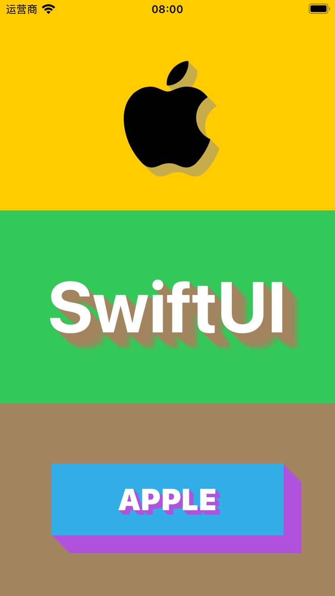

# LongShadow

一个为SwiftUI视图添加长阴影效果的轻量级库，提供两种使用方式：视图修饰器（ViewModifier）和独立视图组件（View）。

## 示例展示



## 功能特性

- 🌈 支持自定义阴影颜色
- 📏 可调整阴影长度（偏移量）
- 🔮 可选模糊渐变效果
- 🖼️ 适用于任意SwiftUI视图

## 安装方式

### Swift Package Manager

1. 在Xcode菜单中选择 `File > Add Packages...`
2. 输入仓库URL：`https://github.com/swiftuihome/LongShadow.git`
3. 选择版本规则
4. 点击 `Add Package`

或直接在 `Package.swift` 中添加依赖：

```swift
dependencies: [
    .package(url: "https://github.com/swiftuihome/LongShadow.git", from: "1.1.0")
]
```

## 使用指南

### 方式一：视图修饰器（推荐）

```swift
import SwiftUI
import LongShadow

struct LongShadowDemo: View {
    var body: some View {
        VStack(spacing: 0) {
            Image(systemName: "apple.logo")
                .resizable()
                .scaledToFit()
                .frame(height: 120)
                .foregroundColor(.black)
                .longShadow(color: .gray.opacity(0.5), offset: 10)
                .background(.yellow)
            
            Text("SwiftUI")
                .font(.system(size: 80, weight: .bold))
                .foregroundColor(.white)
                .longShadow(color: .brown, offset: 20, isBlur: true)
                .background(.green)
            
            VStack {
                Text("APPLE")
                    .foregroundColor(.white)
                    .font(.largeTitle)
                    .fontWeight(.black)
                    .longShadow(color: .purple, angle: .degrees(45))
            }
            .frame(width: 260, height: 80)
            .background(.cyan)
            .longShadow(color: .purple, offset: 20, angle: .degrees(45))
            .background(.brown)
        }
    }
}

struct LongShadowDemo_Previews: PreviewProvider {
    static var previews: some View {
        LongShadowDemo()
    }
}
```

### 方式二：独立视图组件

```swift
import SwiftUI
import LongShadow

struct LongShadowViewDemo: View {
    var body: some View {
        VStack(spacing: 0) {
            LongShadowView {
                Image(systemName: "apple.logo")
                    .resizable()
                    .scaledToFit()
                    .frame(height: 120)
                    .foregroundColor(.black)
            }
            .background(.yellow)
            
            LongShadowView(color: .brown, offset: 20) {
                Text("SwiftUI")
                    .font(.system(size: 80, weight: .bold))
                    .foregroundColor(.white)
            }
            .background(.green)
            
            LongShadowView(color: .purple, offset: 20, angle: .degrees(45)) {
                VStack {
                    LongShadowView(color: .purple, angle: .degrees(45)) {
                        Text("APPLE")
                            .foregroundColor(.white)
                            .font(.largeTitle)
                            .fontWeight(.black)
                    }
                }
                .frame(width: 260, height: 80)
                .background(.cyan)
            }
            .background(.brown)
        }
    }
}

struct LongShadowViewDemo_Previews: PreviewProvider {
    static var previews: some View {
        LongShadowViewDemo()
    }
}
```

### 参数说明

| 参数    | 类型    | 默认值   | 描述                     |
|---------|---------|----------|--------------------------|
| color   | Color   | .gray    | 阴影颜色                 |
| offset  | Int     | 5        | 阴影长度（偏移量）       |
| isBlur  | Bool    | false    | 是否启用模糊渐变效果     |


## 性能建议

1. 对于静态内容，建议使用`LongShadowView`以获得更好性能
2. 动态内容推荐使用`.longShadow`修饰器
3. 偏移量(offset)不宜过大（通常不超过30）
4. 在列表中使用时考虑性能影响
